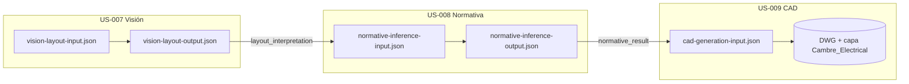

# Contratos del pipeline IA → normativa → CAD

Versionado y proveedor: [ADR-003](../../adr/ADR-003-ai-vision-provider-and-pipeline-contracts.md).

## Encadenamiento



| Paso | Historia | Schema entrada | Schema salida |
|------|----------|----------------|---------------|
| Interpretación visual | US-007 | `vision-layout-input.json` | `vision-layout-output.json` |
| Inferencia normativa | US-008 | `normative-inference-input.json` | `normative-inference-output.json` |
| Generación CAD | US-009 | `cad-generation-input.json` | *(archivo DWG; sin JSON de salida en MVP)* |

**Regla de parseo:** el objeto `layout_interpretation` en la salida US-007 debe ser aceptado sin transformación obligatoria por `normative-inference-input.json` (mismo subschema). Ver fixture `examples/us007-output-us008-input.json`.

## `contract_version`

| Versión | Alcance | Notas |
|---------|---------|--------|
| **1.0.0** | Schemas iniciales T-11 | Constante `PIPELINE_CONTRACT_VERSION` en `apps/api/src/pipelineContracts.ts` |
| *futuro* | Bump **minor** si campos opcionales aditivos | Consumidores antiguos siguen válidos |
| *futuro* | Bump **major** si se renombran/eliminan campos requeridos | Requiere migración y ADR |

Incluir `contract_version` en:

- Cada payload entre servicios (visión, normativa, CAD worker).
- Metadata del job / pipeline cuando se persista en DB.
- Logs estructurados (`contract_version` en eventos `pipeline_*`).

## Validación local

Con [ajv-cli](https://github.com/ajv-validator/ajv-cli) (opcional):

```bash
ajv validate -s docs/contracts/pipeline/vision-layout-output.json \
  -d docs/contracts/pipeline/examples/us007-output-us008-input.json \
  --spec=draft7
```

Los `$ref` entre archivos del mismo directorio asumen resolución relativa al validar el paquete completo.

## Reintentos y timeouts

Documentados en ADR-003: **3** intentos máx. por paso IA (`IA_MAX_ATTEMPTS` en `jobsPipeline.ts`), backoff y rate limits del proveedor **TBD** (S-01).
