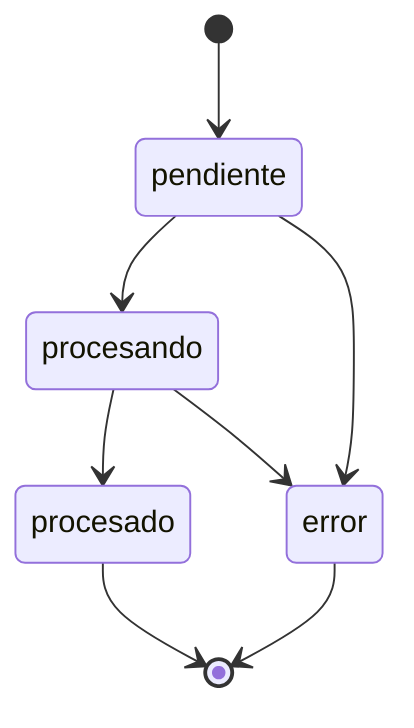

# `job_status` (canonical)

Jobs persist `status` as **Spanish text** in Postgres (`public.jobs.status`), aligned with the API and UI.

| Value | Meaning |
|-------|---------|
| `pendiente` | Created, not yet processing |
| `procesando` | Pipeline running |
| `procesado` | Completed successfully |
| `error` | Terminal failure (see `error` JSON on the job row) |

## Naming convention

- **Storage / API / UI:** lowercase Spanish labels above (not `snake_case`, not English enums).
- **Legacy aliases** accepted on read via `normalizeJobStatus()` in the API: `pending` → `pendiente`, `processing` → `procesando`, `completed` → `procesado`.

## Allowed transitions

See `apps/api/src/jobStatus.ts` (`assertJobStatusTransition`).

## Related tables

- `public.jobs` — source of truth for job metadata and status.
- `public.job_pipeline_queue` — async worker queue (`queued` / `processing` / `done` / `failed`), separate from `job_status`.
