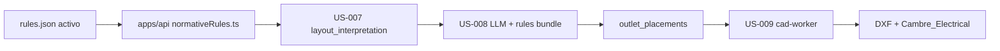

# Reglas normativas (US-008)

Documentación del ruleset del sistema que alimenta la inferencia normativa (US-008) y la capa CAD (US-009).

## Alcance actual

El ruleset activo se enfoca **solo en tomacorrientes (TUG)** por habitación. No cubre:

- Iluminación ni apliques de luz
- Llaves e interruptores
- Circuitos, tablero, canalización
- Cómputo de materiales (BOM)

La salida de US-008 es `outlet_placements[]`; US-009 inserta bloques `CAMBRE_OUTLET` en la capa `Cambre_Electrical`.

## Versión activa

| Campo | Valor |
|-------|--------|
| Versión | `cambre-tomas-2026.07.1` |
| Archivo canónico (repo) | `rules/cambre-normative/2026.07.1/rules.json` |
| Manifest | `rules/cambre-normative/manifest.json` → `active_version` |

Versiones anteriores (`cambre-normative-2026.05.1`, `cambre-vivienda-2026.06.3`) permanecen en el repo para referencia y tests, pero ya no son la versión activa.

## Estructura del ruleset (3 secciones)

Todo ruleset de tomacorrientes debe incluir exactamente estas claves de primer nivel (además de `version`):

| Sección | Propósito |
|---------|-----------|
| `estrategia_procesamiento` | Alcance, pasos del motor (`match_room_type` → `apply_room_rule` → `place_outlets`), valores por defecto (altura, clearance, unidad). |
| `apliques_y_simbologia` | Capa CAD, bloque, color ACI y criterios de colocación (perímetro, evitar vanos, distribución). |
| `reglas_por_habitacion` | Array de reglas; cada entrada tiene `id` (p. ej. `RULE-COCINA`), `room_types[]`, `min_outlets`, `height_mm`, etc. |

Metadatos opcionales: `title`, `description`, `replaces`.

### Reglas por habitación (activas)

| `id` | Ambientes (`room_types`) | Mín. tomas |
|------|--------------------------|------------|
| `RULE-ESTAR` | estar_comedor, living, office, escritorio | 2 |
| `RULE-DORMITORIO` | dormitorio, bedroom | 2 |
| `RULE-COCINA` | cocina, kitchen, cocina_comedor | 2 (1100 mm sobre mesada) |
| `RULE-BANO` | bano, toilette, bathroom | 1 |
| `RULE-PASILLO` | paso_circulacion, hallway, vestibulo_hall, escalera | 1 |
| `RULE-LAVADERO` | lavadero | 2 |
| `RULE-GENERICO` | generico, deposito, garaje, galeria, exterior, storage, other | 1 |

## Flujo en el pipeline



1. **Carga:** la API lee el bundle activo (Postgres o filesystem) y lo cachea al arranque.
2. **US-007:** produce `layout_interpretation` con habitaciones y `room_type`.
3. **US-008:** envía el bundle completo al LLM con un prompt acotado a tomacorrientes (`normativePromptSpec.ts` detecta `reglas_por_habitacion`).
4. **US-009:** usa `outlet_placements` y la simbología de `apliques_y_simbologia.cad_layer`.

En el workspace interactivo, US-008 puede ejecutarse en análisis preliminar (todas las habitaciones) y re-ejecutarse por `room_ids` antes de US-009. Ver [`interactive-workspace-historias.md`](user-stories/interactive-workspace-historias.md).

## Persistencia

| Entorno | Fuente |
|---------|--------|
| Producción / Supabase configurado | Tabla `normative_rulesets` (una fila con `is_active = true`) |
| Tests / local sin Supabase | `rules/cambre-normative/<carpeta>/rules.json` según manifest |

Al arrancar la API (`warmNormativeRulesCache`):

- Si no hay fila activa **o** la versión en DB ≠ `manifest.active_version`, se re-sembrá desde el archivo del repo.
- Ediciones guardadas desde la UI para la **misma** versión activa no se sobrescriben en cada restart.

Migración: `supabase/migrations/20260706120000_normative_rulesets.sql`  
RPC: `activate_normative_ruleset(version, bundle, description, updated_by)`.

Override local (solo desarrollo):

```bash
NORMATIVE_RULES_VERSION=cambre-vivienda-2026.06.3
```

## Editor web

| Ruta | Roles |
|------|-------|
| `/normative-rules` | `architect`, `administrator` |

- Vista estructurada (no JSON crudo): tres secciones ordenadas en el panel lateral.
- Las secciones obligatorias y los `id` de reglas no se pueden borrar ni renombrar.
- Guardado vía `PUT /api/normative-rules` (misma versión que el bundle cargado).

La ruta antigua `/admin/normative-rules` redirige a `/normative-rules`.

## API

| Método | Ruta | Auth | Descripción |
|--------|------|------|-------------|
| `GET` | `/api/normative-rules` | architect o admin | Bundle activo + metadata (`source`, `updated_at`) |
| `PUT` | `/api/normative-rules` | architect o admin | Valida estructura y persiste (Postgres o archivo) |
| `GET` | `/api/jobs/:jobId/normative-rules` | dueño del job | Versión usada en ese trabajo (auditoría) |

Validación (`validateNormativeRulesBundle`):

- Formato tomacorrientes: las 3 secciones obligatorias, `reglas_por_habitacion` no vacío, cada regla con `id` string.
- Formatos legacy siguen aceptados para versiones antiguas: `rules[]` (MVP) o `pipeline[]` (vivienda).

## Contratos del pipeline

Los schemas JSON en `docs/contracts/pipeline/` no cambian de forma breaking: US-008 sigue emitiendo `outlet_placements` con `rule_ids[]`. Los ejemplos usan la versión activa `cambre-tomas-2026.07.1`.

Encadenamiento: [`docs/contracts/pipeline/README.md`](contracts/pipeline/README.md).

## Cómo actualizar reglas

1. Editar en `/normative-rules` (recomendado en staging) **o** modificar `rules/cambre-normative/2026.07.1/rules.json` y desplegar.
2. Para una **nueva versión semver interna**:
   - Crear carpeta `rules/cambre-normative/YYYY.MM.N/rules.json`
   - Añadir entrada en `manifest.json` y actualizar `active_version`
   - Reiniciar API (re-seed en DB) o guardar desde la UI con el nuevo `version`
3. Ejecutar tests: `npm run test --workspace=api` y `./scripts/run-golden-pipeline.sh`

## Referencias de código

| Módulo | Archivo |
|--------|---------|
| Carga y validación | `apps/api/src/normativeRules.ts` |
| Persistencia Postgres | `apps/api/src/normativeRulesStore.ts` |
| Prompt US-008 | `apps/api/src/normativePromptSpec.ts` |
| Editor | `apps/web/src/components/NormativeRulesEditor.tsx` |
